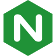

# Hi there 👋, I'm Otman
I like programming, video games, books, and much more.

# Interests
### Programming related
- JS/TS
- Node.js
- C++
- WEB
- Databases concepts

### Outside of programming
- Plants, Fishing, Family activities
- Novels, Mangas, Fantasy such as The witcher, Game of thrones, and more.
- Board games, card games, strategy games and video games such as MtG, AoE2, Diablo2, and more.

# Tools & Languages

    
    
    
    
    
    
    
    
    
     
    
    
    
    
    
    
    
    

___

- Badges comes from https://shields.io
- Icons comes from https://icons8.com
